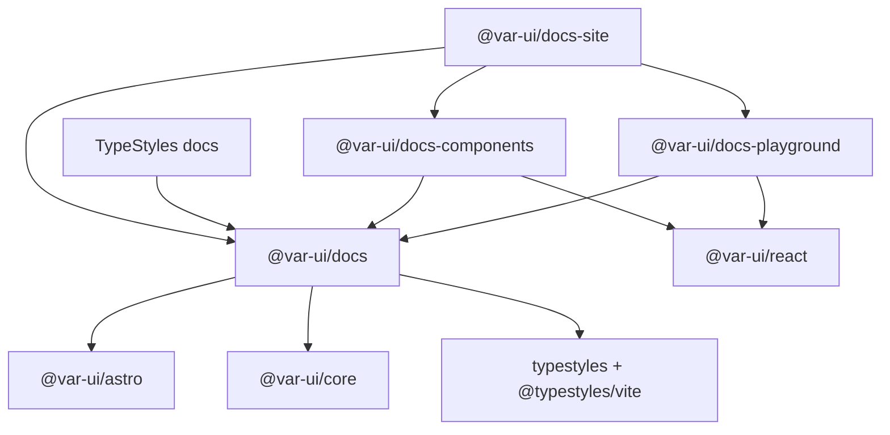

# `@var-ui/docs` — documentation kit built with Var UI

**Date:** 2026-08-11  
**Status:** In progress (Phase 3 complete; general-docs framing locked)  
**Goal:** Ship an Astro docs kit for **general technical documentation**, with Starlight-style plumbing and **Var UI theming DX** (including theme-driven syntax highlighting) as the differentiator.  
**Related:** `docs/superpowers/specs/2026-08-02-theme-playground-design.md`, `docs/src/layouts/BaseLayout.astro`, `../starlight/packages/starlight/index.ts`

## Summary

Create **`@var-ui/docs`**, an Astro integration that provides:

1. **Docs shell** — layout, nav, TOC, search, color mode — built from `@var-ui/astro` primitives (not Starlight CSS).
2. **Unified theming** — same `createDesignTheme()` model for docs chrome, MDX prose, **syntax highlighting** (`color.code.*`), and exported user code.
3. **Content + routing** — `astro:content` collections, catch-all routing, typed frontmatter (replacing `import.meta.glob` + manual slug allowlists).
4. **MDX shortcodes** — core guide shortcodes (`Alert`, `Tabs`, `Steps`, …); design-system demos stay in plugins.
5. **Optional plugins** — component docs (demos, props, framework switcher) and theme playground.

**Primary audience:** any technical docs site (libraries, tools, APIs) — not only design-system catalogs.

**First-class consumers:**

| Consumer                                                                                  | Uses core kit | Uses DS plugins                                  |
| ----------------------------------------------------------------------------------------- | ------------- | ------------------------------------------------ |
| **Var UI docs** (`@var-ui/docs-site`)                                                     | Yes           | Yes (`docs-components`, later `docs-playground`) |
| **TypeStyles docs** ([type-styles/typestyles](https://github.com/type-styles/typestyles)) | Yes           | No                                               |

The kit’s chrome is Var UI + typestyles; the _product being documented_ does not have to be Var UI.

**Not a fork of Starlight.** Starlight’s integration pattern (`injectRoute`, virtual modules, content collections) is the blueprint; Var UI components and typestyles are the implementation.

## Problem

Today the docs site is a bespoke Astro app:

| Concern        | Current state                                                                                | Pain                                                                          |
| -------------- | -------------------------------------------------------------------------------------------- | ----------------------------------------------------------------------------- |
| Layout / nav   | `BaseLayout.astro` + `navigation.ts`                                                         | Not reusable; every new docs consumer would copy-paste                        |
| Content        | `import.meta.glob` per route family                                                          | No typed frontmatter; manual `READY_DOC_SLUGS` gates                          |
| Theming        | Docs scripts (`build-theme-styles.mjs`, `DocsThemePicker`, lazy CSS) wired in `astro.config` | Disconnected from a single config; hard to document “how to theme your docs”  |
| Syntax         | `varUiCodeTheme` in docs only                                                                | Expressive Code–style dual theme config not needed, but integration is manual |
| Component docs | Demos, props, framework switcher                                                             | Valuable differentiator, but entangled with generic docs plumbing             |

A **`packages/docs`** package turns reusable docs plumbing into a product: configure `varDocs()`, add content, optionally add plugins. Design-system catalog features must not pollute the core path that TypeStyles (and similar) would use.

## Goals

| Goal                           | Detail                                                                                      |
| ------------------------------ | ------------------------------------------------------------------------------------------- |
| **General tech docs first**    | Core kit works for guides/API docs without demos, props tables, or framework switchers      |
| **Same theme API as apps**     | Docs theme = `createDesignTheme()` presets; no second “docs theme” vocabulary               |
| **Preset + color mode**        | Showcase presets (Forest, Classic System, …) orthogonal to light/dark/system                |
| **Syntax follows the theme**   | Default Shiki theme uses `color.code.*` CSS variables from the active `createDesignTheme()` |
| **Type-safe shell overrides**  | `theme.components.sideNav`, `topNav`, `toc` via `themeable-components`                      |
| **Starlight-like integration** | One `integrations: [varDocs({ ... })]` entry                                                |
| **Free-form guide routes**     | Consumers declare `{ prefix, collection }` maps — no privileged `/theming` in core          |
| **Phased extraction**          | Var UI docs keeps working at each phase; no big-bang rewrite                                |
| **Plugin boundaries**          | Generic docs kit vs `@var-ui/docs-components` vs `@var-ui/docs-playground`                  |

## Non-goals (v1)

| Item                                     | Reason                                                                                |
| ---------------------------------------- | ------------------------------------------------------------------------------------- |
| Full Starlight i18n parity               | Defer until needed                                                                    |
| Pagefind (default)                       | Keep CommandPalette search index; add Pagefind plugin later                           |
| Runtime `createDesignTheme()` in browser | Playground uses class + CSS var overrides on preview root (existing pattern)          |
| Non–Var UI chrome frameworks             | Shell chrome is Var UI + typestyles; content/product being documented can be anything |
| DS catalog features in core              | Demos, props extract, framework switcher → `@var-ui/docs-components` only             |
| Publishing to npm in v1                  | Workspace package first; publish after dogfooding (Var UI + ideally TypeStyles)       |
| Marketing homepage framework             | Homepage bento stays in consumer site, not core kit                                   |

## Decisions

| Topic                         | Decision                                                                                                                                                |
| ----------------------------- | ------------------------------------------------------------------------------------------------------------------------------------------------------- |
| Package name                  | `@var-ui/docs` (integration + core layout); site package is `@var-ui/docs-site`                                                                         |
| Positioning                   | “Docs kit **built with** Var UI,” not “kit only for documenting Var UI / design systems”                                                                |
| Split                         | `@var-ui/docs` (core) · `@var-ui/docs-components` (demos/props/tabs) · `@var-ui/docs-playground` (theme editor) — plugins optional for guide-only sites |
| vs `@var-ui/astro`            | Keep separate: astro = UI primitives; docs = Astro integration + docs domain                                                                            |
| Routing                       | Free-form `routes` record of `{ prefix, collection }`; inject catch-all per prefix; default `{ docs: { prefix: '/docs', collection: 'docs' } }`         |
| Content                       | `astro:content` + `docsSchema()`; `themingSchema()` remains a thin alias for Var UI docs dogfood                                                        |
| Theme config                  | `varDocs({ theme })` — `defaultClassName`, presets, color mode, **`syntax: 'design-tokens'` (default)**, optional `components` overrides                |
| Syntax highlighting           | Theme owns code colors via `color.code.*`; kit Shiki theme references those CSS vars so presets + color mode restyle fenced blocks automatically        |
| typestyles                    | Integration wires `@typestyles/vite` + documents `typestyles-entry.ts` convention (required for shell CSS)                                              |
| Starlight component overrides | Virtual modules `virtual:var-docs/components/*` (same idea as Starlight)                                                                                |
| Dogfood targets               | Var UI docs (full); TypeStyles docs (core-only) as second consumer when API is stable enough                                                            |

## Package architecture

```
packages/docs/                          # @var-ui/docs
  index.ts                              # default export: varDocs()
  schema.ts                             # frontmatter + config Zod schemas
  types.ts
  integrations/
    mdx.ts
    remark-asides.ts                    # :::note → Alert (optional v1)
    rehype-heading-links.ts
    rehype-slug.ts
    vite-virtual-modules.ts
    typestyles.ts                       # @typestyles/vite wiring
    theme-css-extract.ts                # lazy preset CSS build hook
  routes/
    static/index.astro
    static/404.astro
  components/
    DocsPage.astro                      # shell (from BaseLayout)
    DocsSidebar.astro
    DocsToc.astro
    DocsSearch.astro
    DocsThemePicker.astro               # optional when presets configured
  user-components/                      # global MDX components
    Aside.astro
    Tabs.astro / TabItem.astro
    Steps.astro
  utils/
    routing.ts
    navigation.ts
    generateToc.ts
    theme/
      apply-preset.ts
      lazy-css.ts
      shiki-theme.ts
  locals.ts
  virtual.d.ts

packages/docs-components/               # @var-ui/docs-components (plugin)
  index.ts                              # componentDocsPlugin()
  Demo.astro
  PropsTable.astro
  ComponentDocTemplate.astro
  framework-middleware.ts

packages/docs-playground/               # @var-ui/docs-playground (plugin)
  index.ts                              # themePlaygroundPlugin()
  ...                                   # extract from docs/src/components/theme-playground/
```

### Dependency graph



## Integration API

### Minimal consumer config (general tech docs)

TypeStyles-style site — core kit only, no DS plugins:

```ts
import { defineConfig } from 'astro/config';
import varDocs from '@var-ui/docs';
import { defaultThemeClassName } from '@var-ui/core';

export default defineConfig({
  integrations: [
    varDocs({
      title: 'TypeStyles',
      topNav: [{ text: 'Docs', link: '/docs/getting-started', match: '/docs' }],
      sidebar: [
        {
          title: 'Guides',
          items: [{ text: 'Getting started', link: '/docs/getting-started' }],
        },
      ],
      theme: {
        // Same createDesignTheme() class used by the shell.
        defaultClassName: defaultThemeClassName,
        // Default — Shiki reads color.code.* from the active theme.
        syntax: 'design-tokens',
      },
      typestyles: { entry: 'typestyles-entry.ts' },
      routes: {
        docs: { prefix: '/docs', collection: 'docs' },
      },
      components: {
        Layout: './src/layouts/BaseLayout.astro',
      },
    }),
  ],
});
```

### Var UI docs site (core + site-owned sections)

```ts
import { defineConfig } from 'astro/config';
import react from '@astrojs/react';
import varDocs from '@var-ui/docs';
import { defaultThemeClassName } from '@var-ui/core';

export default defineConfig({
  integrations: [
    varDocs({
      title: 'Var UI',
      topNav: [
        { text: 'Docs', link: '/docs/getting-started', match: '/docs' },
        { text: 'Components', link: '/components', match: '/components' },
        { text: 'Theming', link: '/theming', match: '/theming' },
      ],
      theme: {
        defaultClassName: defaultThemeClassName,
        syntax: 'design-tokens',
      },
      typestyles: { entry: 'typestyles-entry.ts' },
      // Free-form map — `/theming` is a consumer choice, not a kit privilege.
      routes: {
        docs: { prefix: '/docs', collection: 'docs' },
        theming: { prefix: '/theming', collection: 'theming' },
      },
      components: {
        Layout: './src/layouts/BaseLayout.astro',
      },
    }),
    react(),
  ],
});
```

### Full `VarDocsConfig` (target shape)

```ts
type VarDocsConfig = {
  /** Site title — used in `<title>` and header when no logo. */
  title: string;

  /** Optional logo config (image + alt, or text). */
  logo?: LogoConfig;

  /** Top navigation items (maps to TopNav). */
  topNav?: TopNavItem[];

  /**
   * Sidebar sections. Static config and/or generated from collections
   * via `sidebarFrom: 'components' | 'docs'`.
   */
  sidebar?: SidebarSection[] | SidebarConfig;

  /** Docs chrome + syntax + presets. */
  theme: VarDocsThemeConfig;

  /** typestyles build integration. */
  typestyles: {
    /** Main CSS extraction entry (imports core styles + site recipes). */
    entry: string;
    /**
     * Optional glob of theme preset modules for per-preset lazy CSS
     * (runs extract at build; outputs public/themes/{id}.css).
     */
    extractPresets?: string;
  };

  /** Search — CommandPalette index builder or custom fn. */
  search?: {
    buildIndex?: () => DocsSearchItem[];
  };

  /** Route prefixes → collection + template mapping. */
  routes?: RouteMap;

  /** Override shell components (Starlight-style virtual modules). */
  components?: Partial<VarDocsComponents>;

  /** Optional plugins. */
  plugins?: VarDocsPlugin[];

  /** SSR / prerender — default true for docs routes. */
  prerender?: boolean;

  /** Disable injected 404 route. */
  disable404Route?: boolean;
};
```

### `VarDocsThemeConfig`

```ts
type VarDocsThemeConfig = {
  /** Class on `<html>` for SSR first paint (ThemeScript). */
  defaultClassName: string;

  /**
   * Showcase / brand presets for floating picker + lazy CSS.
   * `preset` enables playground export (`from: forestPreset`).
   */
  presets?: Array<{
    id: string;
    label: string;
    className: string;
    swatch?: string;
    lazyCss?: boolean;
    preset?: DesignThemePreset;
  }>;

  /** Light / dark / system — ColorModeToggle. Orthogonal to presets. */
  colorMode?: {
    default?: 'light' | 'dark' | 'system';
    storageKey?: string;
  };

  /**
   * Docs-shell recipe overrides — typed against themeable-components
   * (sideNav, topNav, toc, proseContent, codeBlock, …).
   */
  components?: ThemeComponentsConfig;

  /**
   * Shiki theme for MDX fenced blocks.
   * `'design-tokens'` (default) → semantic `color.code.*` CSS variables from
   * the active createDesignTheme() so syntax tracks presets + color mode.
   * Pass a Shiki theme object only when opting out of token-driven highlighting.
   */
  syntax?: 'design-tokens' | ShikiTheme;
};
```

**Theming DX (core differentiator — keep for all consumers):**

1. Author a theme with `createDesignTheme()` (including `color.code.*` for syntax).
2. Pass `theme.defaultClassName` so SSR/first paint matches.
3. Leave `syntax: 'design-tokens'` (default) so fenced MDX code uses those CSS variables.
4. Optional later: `theme.presets` for a floating picker + lazy CSS (Phase 5).

A TypeStyles docs site still uses this path: Var UI theme for chrome + code colors; typestyles for compiling site CSS. It does **not** need component demos or the playground.

### Route map

Free-form record — **no privileged keys**. Kit default when omitted:

| URL prefix | Collection | Template | Notes                  |
| ---------- | ---------- | -------- | ---------------------- |
| `/docs/*`  | `docs`     | `guide`  | Standard article + TOC |

Consumer examples:

| Site           | Example `routes`                                                      |
| -------------- | --------------------------------------------------------------------- |
| TypeStyles     | `{ docs: { prefix: '/docs', collection: 'docs' } }`                   |
| Var UI docs    | `{ docs: …, theming: { prefix: '/theming', collection: 'theming' } }` |
| Custom library | `{ guides: { prefix: '/guides', collection: 'guides' }, api: { … } }` |

Plugin-owned routes (not in core `routes`):

| URL prefix      | Owner             | Notes               |
| --------------- | ----------------- | ------------------- |
| `/components/*` | `docs-components` | Component catalog   |
| `/playground/*` | `docs-playground` | Theme editor        |
| `/`             | consumer page     | Not injected by kit |

```ts
type GuideRoutePrefix = { prefix: string; collection: string };

/** Named entries are labels only — matching uses prefix + collection. */
type RouteMap = Record<string, GuideRoutePrefix>;
```

### Content collections (consumer `src/content.config.ts`)

Guide-only site:

```ts
import { defineCollection } from 'astro:content';
import { glob } from 'astro/loaders';
import { docsSchema } from '@var-ui/docs/schema';

const docs = defineCollection({
  schema: docsSchema(),
  loader: glob({ base: './content/docs', pattern: '**/*.{md,mdx}' }),
});

export const collections = { docs };
```

Var UI docs (extra guide collection + later component plugin schema):

```ts
import { defineCollection } from 'astro:content';
import { glob } from 'astro/loaders';
import { docsSchema, themingSchema } from '@var-ui/docs/schema';
// Phase 4: componentDocsSchema from '@var-ui/docs-components'

const docs = defineCollection({
  schema: docsSchema(),
  loader: glob({ base: './content/docs', pattern: '**/*.{md,mdx}' }),
});

const theming = defineCollection({
  schema: themingSchema(), // alias of docsSchema for dogfood
  loader: glob({ base: './content/theming', pattern: '**/*.{md,mdx}' }),
});

export const collections = { docs, theming };
```

**`componentDocsSchema` extensions** (for registry integration):

```ts
// Extends base docs fields
{
  title: string;
  description?: string;
  category?: ComponentCategory;      // or derived from registry
  pagefind?: boolean;
  template?: 'doc' | 'splash';
  tableOfContents?: boolean | { minHeadingLevel?: number; maxHeadingLevel?: number };
}
```

## Integration hooks (implementation contract)

Mirrors Starlight `index.ts` responsibilities:

| Hook                 | Responsibility                                                                                             |
| -------------------- | ---------------------------------------------------------------------------------------------------------- |
| `astro:config:setup` | `injectRoute` `[...slug]` + 404; `addMiddleware` locals; push MDX integration; `updateConfig` vite plugins |
| `astro:config:done`  | Inject TypeScript types for virtual modules + `Astro.locals.varDocsRoute`                                  |
| `astro:build:done`   | Optional Pagefind (future); theme CSS extract for `lazyCss` presets                                        |

**Vite plugins:**

| Plugin                                 | Role                                     |
| -------------------------------------- | ---------------------------------------- |
| `vite-plugin-var-docs-virtual-modules` | Config, component overrides, user CSS    |
| `vite-plugin-var-docs-typestyles`      | `@typestyles/vite` with config entry     |
| `vite-plugin-var-docs-theme-extract`   | Build per-preset CSS to `public/themes/` |

**Middleware (`locals.ts`):**

```ts
interface Locals {
  varDocsRoute?: VarDocsRouteData;
  framework?: DocsFramework; // from docs-components plugin only
}
```

`VarDocsRouteData` (analogous to `starlightRoute`):

```ts
type VarDocsRouteData = {
  id: string;
  slug: string;
  entry: CollectionEntry;
  Content: MDXComponent;
  headings: MarkdownHeading[];
  toc: TocItem[] | false;
  sidebar: SidebarSection[];
  hasSidebar: boolean;
  template: 'guide' | 'splash' | 'component' | 'playground';
  title: string;
  description?: string;
};
```

## Layout shell (`DocsPage.astro`)

Extract from `docs/src/layouts/BaseLayout.astro` with these invariants:

| Piece            | Source component                            | Config-driven                   |
| ---------------- | ------------------------------------------- | ------------------------------- |
| App shell        | `AppShell`                                  | `variant`, `mobileBreakpoint`   |
| Top nav          | `TopNav`, `TopNavItem`                      | `topNav`                        |
| Side nav         | `SideNav` + `DocsSidebar`                   | `sidebar` / route-derived       |
| Mobile nav       | `MobileNav`                                 | when sidebar present            |
| Main layout      | `Layout`, `LayoutPanel`, `LayoutContent`    | TOC column when `toc` enabled   |
| Color mode       | `ColorModeToggle`                           | `theme.colorMode`               |
| Theme presets    | `DocsThemePicker`                           | when `theme.presets.length > 0` |
| Search           | `DocsSearch`                                | `search.buildIndex`             |
| Theme script     | `ThemeScript` + typestyles reattach         | always                          |
| View transitions | `ClientRouter` + `transition:persist` slots | optional config flag            |

**Prose styling:** MDX body uses `proseContent` recipe from core (not global `.docs-article` ad hoc CSS). Consumer-specific article tweaks move to `theme.components.proseContent`.

## Theming subsystem

### Principles

1. **One model** — `createDesignTheme({ name, from, tokens, colorMode, components })` for apps and docs.
2. **Two axes** — preset (`className` on `<html>`) × color mode (`data-mode` / `color-scheme`).
3. **Lazy preset CSS** — non-default presets with `lazyCss: true` load `/themes/{id}.css` on switch (existing `ensureDocsThemeStyles` pattern).
4. **Syntax parity** — `varUiCodeTheme` / `codeHighlight.ts` scopes reference `t.color.code.*`; switching preset or color mode updates fenced code without Expressive Code.

### Build-time flow

```
typestyles-entry.ts
  → @var-ui/core/styles
  → site recipes (docs shell, prose, …)
  → default theme registration

theme.presets[].lazyCss
  → typestyles-themes/{id}.ts (or src/themes/{id}.ts)
  → build extracts theme-only CSS → public/themes/{id}.css
```

Integration runs extract in `prebuild` or `astro:build:setup` when `extractPresets` is set.

### Runtime flow

```
ThemeScript (defaultClassName + color mode)
  → first paint

DocsThemePicker
  → localStorage docs-theme-id
  → swap html className
  → ensureDocsThemeStyles (inject link href if lazy)

ClientRouter navigation
  → reattachTypestyles.ts (ensureDocumentStylesAttached)

ColorModeToggle
  → theme-mode storage (orthogonal to preset id)
```

### Theme playground plugin (`@var-ui/docs-playground`)

Reuses approved design from `2026-08-02-theme-playground-design.md`:

- Route: `/playground` or `/theming/playground` (configurable).
- State → `generateThemeCode()` export.
- Preview scoped to playground root (not full sitewide chrome) in v1; optional sitewide preset picker uses same preset list as `theme.presets`.

**Config extension:**

```ts
themePlaygroundPlugin({
  route: '/playground',
  preview: 'bento' | 'component-grid',
  presets: 'from-config', // uses varDocs theme.presets
});
```

## MDX pipeline

### Default global components

| Shortcode          | Var UI mapping                       |
| ------------------ | ------------------------------------ |
| `Aside`            | `Alert` or `Banner` (tone from type) |
| `Tabs` / `TabItem` | `Tabs`                               |
| `Steps`            | styled ordered list (prose + tokens) |
| `LinkCard`         | `Card` + `Link`                      |

Registered via MDX `components` in route render + overridable per consumer.

### Remark / rehype (v1 minimum)

| Plugin                 | Purpose                                  |
| ---------------------- | ---------------------------------------- |
| `rehype-slug`          | Heading IDs for TOC                      |
| `rehype-heading-links` | Optional anchor links                    |
| `remark-asides`        | `:::note` directives (v1.1 if timeboxed) |

### Code blocks

- Astro markdown `shikiConfig.theme` = `buildShikiThemeFromDesignTokens()` when `syntax: 'design-tokens'`.
- Demo chrome / `HighlightedCodeBlock` use same token source (`codeHighlight.ts` pattern).

## `@var-ui/docs-components` plugin

For design-system documentation sites.

### Features

| Feature               | Implementation source                                            |
| --------------------- | ---------------------------------------------------------------- |
| `<Demo id="..." />`   | `DemoHost.astro` + `registry.ts` pattern                         |
| Framework switcher    | `framework.ts` middleware + `FrameworkSwitcher`                  |
| Props table           | `extract-props-plugin` + `PropsTable`                            |
| Component doc tabs    | `ComponentDocTabs` (documentation / playground / props / styles) |
| Sidebar from registry | `componentRegistry` + `categoryLabels`                           |

### Plugin config

```ts
componentDocsPlugin({
  registry: './src/data/components.ts',
  demos: './src/demos/registry.ts',
  frameworks: ['react', 'astro', 'html'],
  defaultFramework: 'react',
  extractProps: {
    packages: ['@var-ui/react', '@var-ui/astro'],
  },
  tabs: ['documentation', 'playground', 'props', 'styles'],
});
```

### MDX component injection

```tsx
<Content
  components={{
    Demo: DemoHost,
    PropsTable: HiddenPropsTable, // hides inline props h2 in MDX
    ...varDocsDefaultMdxComponents,
  }}
/>
```

## Virtual module overrides

Same ergonomics as Starlight `components` config:

```ts
varDocs({
  components: {
    Header: './src/components/CustomHeader.astro',
    Sidebar: '@var-ui/docs/components/DocsSidebar.astro',
    ThemePicker: false, // disable floating preset picker
  },
});
```

Resolved modules:

- `virtual:var-docs/components/Page`
- `virtual:var-docs/components/Sidebar`
- `virtual:var-docs/components/Search`
- `virtual:var-docs/components/ThemePicker`
- `virtual:var-docs/user-css`
- `virtual:var-docs/config` — serialized `VarDocsConfig`

## Token reference shortcode (v1.1)

`<TokenReference />` — build-time flatten of design + component CSS variables from `@var-ui/core` (existing `TokenReferenceTable` + `flattenTokenReferenceRows`).

Ship as optional export from `@var-ui/docs-components` or `@var-ui/docs/theming`.

## Phased delivery

### Phase 1 — Extract shell (no routing change)

**Outcome:** `packages/docs` exists; Var UI docs imports layout from kit.

| Action                                  | Detail                                                                                                           |
| --------------------------------------- | ---------------------------------------------------------------------------------------------------------------- |
| Create `packages/docs` package skeleton | `package.json`, tsconfig, vite test                                                                              |
| Move                                    | `BaseLayout` → `DocsPage`, sidebar, TOC, search, theme picker, `docs-theme.ts`, `docs-toc.ts`, `search-index.ts` |
| Move                                    | `reattachTypestyles.ts`, `DocsThemeScript` patterns                                                              |
| Export                                  | `@var-ui/docs/layout` subpath for advanced consumers                                                             |
| Docs site                               | Replace imports; verify visual parity                                                                            |

**Success:** `pnpm docs:dev` unchanged; `vp test` green.

### Phase 2 — Integration + typestyles wiring

**Outcome:** `varDocs()` registers vite plugins, middleware stub, typestyles entry.

| Action                             | Detail                                      | Status |
| ---------------------------------- | ------------------------------------------- | ------ |
| Implement `varDocs()` minimal hook | typestyles vite plugin, default Shiki theme | Done   |
| Config schema                      | Zod validate `title`, `theme`, `typestyles` | Done   |
| Virtual module                     | `virtual:var-docs/config`                   | Done   |
| Docs site                          | Slim `astro.config.mjs`                     | Done   |

**Success:** docs config is mostly `varDocs({ ... })`. ✅

### Phase 3 — Content collections + catch-all route

**Outcome:** Replace globs and slug allowlists.

| Action                              | Detail                                                            | Status |
| ----------------------------------- | ----------------------------------------------------------------- | ------ |
| Export schemas                      | `docsSchema`, `themingSchema`                                     | Done   |
| Add `src/content.config.ts` in docs | loaders for docs, theming                                         | Done   |
| Implement `matchGuideRoute()`       | prefix → collection → entry id                                    | Done   |
| Guide pages                         | Site-owned `GuideArticle` + docs/theming pages (Netlify SSR-safe) | Done   |
| Remove                              | `READY_DOC_SLUGS`, per-folder globs for docs/theming              | Done   |
| Keep                                | `components/[slug].astro` until Phase 4                           | Done   |

**Note:** Kit `injectRoute` + package middleware are available but disabled on the docs site (`disableGuideRoutes` / `disableMiddleware`) because `@astrojs/netlify` SSR loads workspace `.astro` / middleware entrypoints via Node ESM. Site pages use the same kit routing helpers + content collections.

**Success:** `/docs/getting-started`, `/theming/*` served via collections; typed frontmatter; no globs for docs/theming. ✅

### Phase 4 — `docs-components` plugin

**Outcome:** Component catalog chrome + extract-props live in `@var-ui/docs-components`; site keeps demos/registry/props tables (product-specific) and Netlify-safe routes.

| Action                            | Detail                                                            | Status   |
| --------------------------------- | ----------------------------------------------------------------- | -------- |
| Create `packages/docs-components` | `componentDocsPlugin()` + config                                  | Done     |
| Framework switcher                | Moved helpers + `FrameworkSwitcher`                               | Done     |
| `ComponentDocTabs` + schema       | Package chrome + `componentDocsSchema()`                          | Done     |
| extract-props                     | Plugin `extractProps.write` callback                              | Done     |
| Docs site                         | Wires plugin; site-owned `/components` + middleware               | Done     |
| DemoHost / PropsTable             | Remain in docs-site (HighlightCode / Var UI API docs) — Phase 4.1 | Deferred |

**Success:** `/components/button` parity; framework switcher works; extract-props via plugin. ✅

### Phase 5 — Theme subsystem hardening

**Outcome:** Full `theme.presets` drives picker + lazy CSS extract.

| Action                    | Detail                                                                        | Status |
| ------------------------- | ----------------------------------------------------------------------------- | ------ |
| Theme extract integration | Kit `docsThemeStylesDevPlugin` + `buildDocsThemeStyles` / `astro:build:start` | Done   |
| `theme.presets` config    | Zod + `docs/src/themes/presets.ts` single list                                | Done   |
| DocsThemePicker / Script  | Moved to `@var-ui/docs`; read presets from virtual config                     | Done   |
| `theme.components` proof  | Deferred — showcase themes already use `createDesignTheme({ components })`    | Skip   |

**Success:** adding a preset = theme TS + `typestyles-themes/{id}.ts` + entry in `presets.ts`. ✅

### Phase 6 — `docs-playground` plugin

**Outcome:** Playground extracted; export uses config presets.

| Action                            | Detail                                          |
| --------------------------------- | ----------------------------------------------- |
| Create `packages/docs-playground` | move theme-playground island                    |
| `themePlaygroundPlugin()`         | route + full-width template                     |
| Wire                              | `generateThemeCode` to `theme.presets[].preset` |

**Success:** playground works; export matches customize.mdx examples.

### Phase 7 — Polish + optional Starlight parity

| Item                       | Priority        |
| -------------------------- | --------------- |
| `remark-asides`            | Medium          |
| `TokenReference` shortcode | Medium          |
| Pagefind plugin            | Low             |
| Edit links / prev-next     | Low             |
| i18n                       | Low             |
| npm publish `@var-ui/docs` | When API stable |

## Migration map (current `docs/` → packages)

| Current path                          | Target                                                   |
| ------------------------------------- | -------------------------------------------------------- |
| `src/layouts/BaseLayout.astro`        | `packages/docs/components/DocsPage.astro`                |
| `src/components/DocsSidebarNav.astro` | `packages/docs/components/DocsSidebar.astro`             |
| `src/components/DocsToc.astro`        | `packages/docs/components/DocsToc.astro`                 |
| `src/components/DocsSearch.astro`     | `packages/docs/components/DocsSearch.astro`              |
| `src/components/DocsThemePicker.*`    | `packages/docs/components/DocsThemePicker.*`             |
| `src/lib/docs-theme.ts`               | `packages/docs/utils/theme/*`                            |
| `src/lib/docs-toc.ts`                 | `packages/docs/utils/generateToc.ts`                     |
| `src/lib/search-index.ts`             | `packages/docs/utils/search-index.ts`                    |
| `src/lib/shikiCodeTheme.ts`           | `packages/docs/utils/theme/shiki-theme.ts`               |
| `src/scripts/reattachTypestyles.ts`   | `packages/docs/scripts/reattachTypestyles.ts`            |
| `scripts/build-theme-styles.mjs`      | `packages/docs/integrations/theme-css-extract.ts`        |
| `src/lib/extract-props-plugin.ts`     | `packages/docs-components/integrations/extract-props.ts` |
| `src/components/DemoHost.astro`       | `packages/docs-components/Demo.astro`                    |
| `src/demos/registry.ts`               | stays in consumer (data)                                 |
| `src/data/components.ts`              | stays in consumer (registry)                             |
| `src/components/homepage/*`           | stays in consumer                                        |
| `content/**`                          | stays in consumer                                        |

## Testing strategy

| Layer                 | Tests                                                             |
| --------------------- | ----------------------------------------------------------------- |
| Config schema         | Zod invalid/valid fixtures                                        |
| `resolveVarDocsRoute` | URL → collection + template cases                                 |
| `findMdxModule`       | retired after Phase 3; replace with collection loader tests       |
| Theme utils           | `getDocsThemeClassName`, lazy CSS href, Shiki theme token refs    |
| `generateThemeCode`   | stays in playground package                                       |
| Integration smoke     | `vp test` in `packages/docs` with fixture Astro project (minimal) |
| Visual                | Manual dogfood on var-ui docs each phase                          |

## Risks and mitigations

| Risk                               | Mitigation                                                                          |
| ---------------------------------- | ----------------------------------------------------------------------------------- |
| Scope creep (full Starlight clone) | Non-goals table; plugins for DS-specific features; TypeStyles as guide-only dogfood |
| Core reads as “design-system only” | Free-form `routes`; `themingSchema` as alias; README positions general docs first   |
| Losing theming DX for general docs | Keep `createDesignTheme` + `syntax: 'design-tokens'` as core defaults               |
| API churn before publish           | Workspace-only until Phase 6; semver 0.x                                            |
| typestyles + view transitions      | Keep `reattachTypestyles` in kit default script                                     |
| Lazy theme CSS FOUC                | `ThemeScript` + blocking link for active preset                                     |
| Catch-all vs custom pages          | Homepage, dev smoke pages stay outside injected route                               |
| Monorepo path aliases              | Kit uses package imports; consumer vite aliases only for local dev of core          |

## Success criteria

### Phase 1–2 (MVP kit)

- [x] `packages/docs` package builds and tests in monorepo
- [x] Var UI docs site uses `DocsPage` from kit with no visual regression
- [x] `varDocs({ title, theme, typestyles })` validates and wires typestyles + Shiki (`design-tokens` default)
- [x] `vp check` and `vp test` pass

### Phase 3–4 (routing + component docs)

- [x] Guide pages use `astro:content` + kit routing helpers
- [x] `routes` is a free-form map (no privileged `theming` key in core defaults)
- [x] `@var-ui/docs-components` plugin: framework switcher, tabs, extract-props, schema
- [ ] DemoHost / PropsTable move into plugin (Phase 4.1)
- [x] No `import.meta.glob` in page routes for content MDX (guides); components still glob until 4.1/collections

### Phase 5–6 (theming product)

- [x] Adding a showcase preset is config (`theme.presets`) + theme file only
- [x] Fenced code + demos track preset and color mode via `color.code.*`
- [ ] Theme playground plugin exports valid `createDesignTheme()` code
- [ ] `content/theming/customize.mdx` examples match kit config shape

### Long term

- [ ] Guide-only Astro site (e.g. TypeStyles) can add `varDocs()` without DS plugins in &lt;1 day
- [ ] Theming DX is a documented differentiator vs Starlight (single `createDesignTheme` path, including syntax)
- [ ] TypeStyles docs dogfoods `@var-ui/docs` core

## Open questions

1. **Package publish surface** — single `@var-ui/docs` with subpath exports vs three npm packages from day one? → **Proposed:** workspace packages first; publish core before plugins.
2. **Default search** — CommandPalette-only vs Pagefind in v1? → **Proposed:** CommandPalette default.
3. **Splash template** — needed for Var UI homepage migration, or keep homepage fully custom forever? → **Proposed:** homepage stays consumer-owned.
4. **SSR default** — Var UI docs uses `output: 'server'` + Netlify; kit default `prerender: true` for docs routes? → **Proposed:** `prerender: true` with adapter override; keep `disableGuideRoutes` escape hatch for Netlify SSR workspace quirks.
5. **TypeStyles dogfood timing** — after Phase 5 theming hardening, or earlier with core-only? → **Proposed:** core-only spike once free-form `routes` + README examples land.

## References

- [Starlight](https://starlight.astro.build/) — integration pattern reference
- Local Starlight: `../starlight/packages/starlight/index.ts`
- [TypeStyles](https://github.com/type-styles/typestyles) — target general-docs consumer
- Var UI theme playground spec: `docs/superpowers/specs/2026-08-02-theme-playground-design.md`
- Var UI customize guide: `docs/content/theming/customize.mdx`
